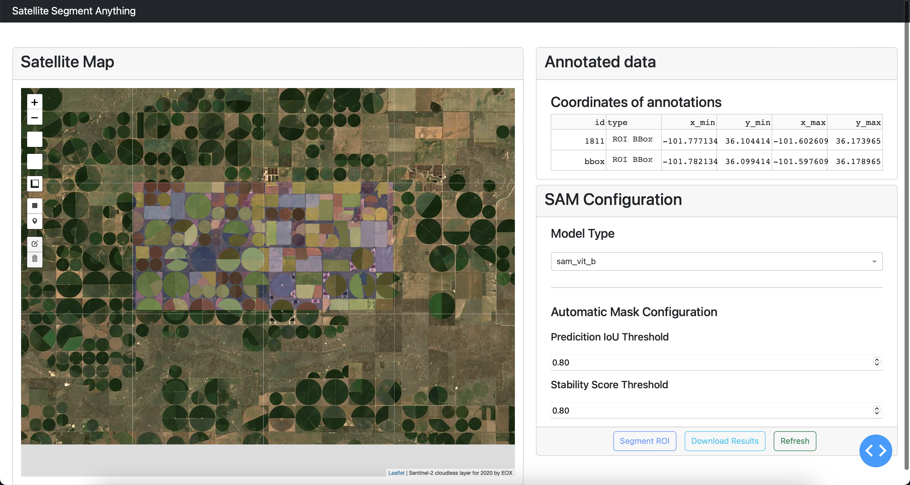
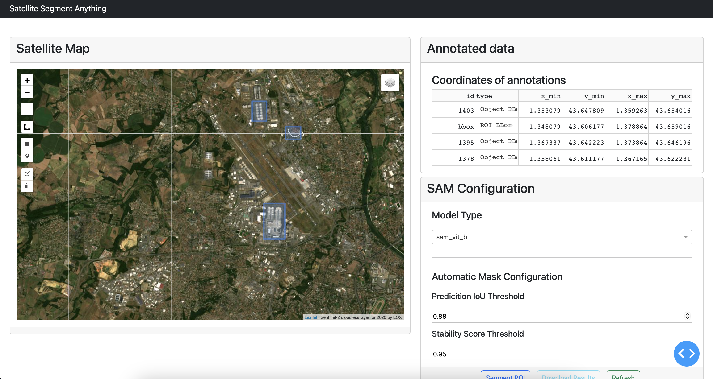

# Satellite SAM Dashboard

## About this app

This app integrates the Segment Anything Model <sup>[1](#sam)</sup> (SAM) with Sentinel-2 data. The app is built using Dash Plotly and dash leaflet <sup>[2](#dash)</sup>. It allows segmenting satellite images using the two ways provided by SAM: automatic mask generator and prompt segmentation (using points and bounding boxes).

## Environment

[](https://www.python.org/downloads/release/python-310/)

## Features

- Integration of Sentinel-2 using WMS protocol.
- OSM as base map.
- Downloading Sentinel-2 data directly from the app using an ROI.
- Integration of the three available models from Meta of SAM.
- The ability to directly annotate Sentinel-2 images using bounding boxes and points.
- Different support of bounding boxes:
  - ROI
  - Object BBox
- Different support of points:
  - Foreground points
  - Background points
- Modify location of bounding boxes and points.
- Provide prompts for more than one object at a time.
- Refine segmentation inside a bounding box of an object by adding foreground and background points.
- Visualize the obtained results directly on the map.
- Download the results (RGB GeoTiff of the ROI, segmentation mask in PNG and GeoTiff).

## How to deploy the app

### Dev

1. Clone the repository, checkout to the dev branch, create a virtual environment and install the requirements.

```bash
git clone https://github.com/AlbughdadiM/satellite-sam-dashboard.git
cd satellite-sam-dashboard
git checkout dev
python3.10 -m venv myven
source myvenv/bin/activate
python3.10 -m pip install -r requirements.txt
```

Note that the installation of rasterio requires GDAL to be installed <sup>[3](#gdal)</sup>.
2. Once all the dependencies are installed, do the following

```bash
cd src
python3.10 app.py
```

3. Navigate to 127.0.0.1:8050 to start working with the app.

### Prod

1. Clone the repository, checkout to the main branch, build the docker image and create a container.

```bash
git clone https://github.com/AlbughdadiM/satellite-sam-dashboard.git
cd satellite-sam-dashboard
docker build . -t satellite-sam-dashboard:v0.1
docker run --name=dashboard -p 8080:8080 satellite-sam-dashboard:v0.1
```

## Screenshot of the app


## HowTo

The app provides two options to use SAM with Sentinel-2 images:

1. **Automatic Mask Generation**

    <ol type="a">
    <li>The user draws a bounding box on the ROI to generate a segmentation mask for.</li>

    

    

    <li>The bounding box annotation will be added to the table "annotated data" marking xmin, ymin, xmax, ymax, id and the type of the geometry.</li>

    

    <li>To generate an automatic mask for the whole region covered by the bounding box, the user must select type as <b><i>"ROI BBox"</i></b>.</li>

    

    <li>In the Automatic Mask Configuration part of the dashboard, the two parameters <b> <i> prediction IoU threshold and stability score threshold </b></i> contol the results of the generated mask.</li>
    <li>Once the ROI is selected and the parameters are adjusted, click on <b><i>Segment ROI</b></i>. </li>
    <li>The user can visualize the obtained results on the map. </li>

    

    <li>The user can download the results as a zip file by clicking on <b><i>Download Results</b></i></li>

    

    <li>To start a new segmentation task, click on <b><i>Refresh</i></b>. </li>
    </ol>

2. **SAM Prompts**
    <ol type="a">
    <li>The user draws a bounding box around the object to be segmented using the bounding box drawing tool.</li>

    

    <li>The user can obtain a binary mask showing the object inside this bounding box.</li>

    

    <li>The user can refine the segmentation results by using foreground and background points.</li>

    

    

    <li>The user can draw multiple bounding boxes associated with multiple objects in the satellite image. Additionally, each bounding box can be associated with multiple foreground and background points.</li>

    <li>Once the object is selected and the supporting points, click on <b><i>Segment ROI</b></i>. </li>

    <li>The user can visualize the obtained results on the map. </li>

    <li>The user can download the results as a zip file by clicking on <b><i>Download Results</b></i></li>

    

    <li>To start a new segmentation task, click on <b><i>Refresh</i></b>. </li>
  </ol>

## References

<a name="sam">1</a> <https://github.com/facebookresearch/segment-anything/tree/main>

<a name="dash">2</a> <https://plotly.com/dash/>

<a name="gdal">3</a> <https://gdal.org/download.html>
